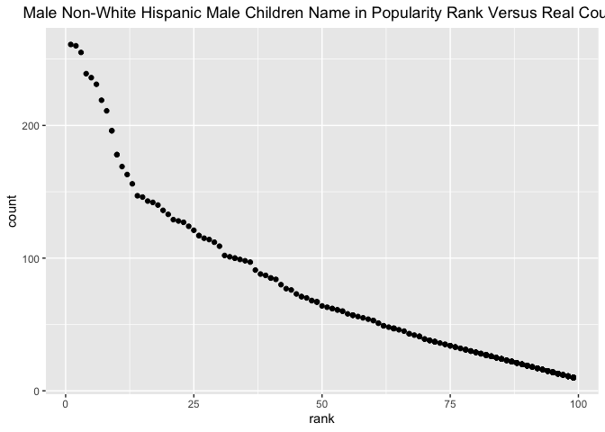

p8105\_hw2\_tk2886
================
Tanvir Khan
2021-10-02

# Problem 1

### Importing Mr.Trash Wheel Data. Mr.Trash Wheel is an Excel File.

``` r
trashwheel_data <- 
  read_excel(
    "./data/TrashWheel/Trash-Wheel-Collection-Totals-7-2020-2.xlsx",
    sheet = "Mr. Trash Wheel",
    range = "A2:N408",
    )
```

### Cleaning Mr.Trash Wheel Data

``` r
trashwheel_data <-
    trashwheel_data %>%
    janitor::clean_names() 
```

### Using filter, mutate, as.integer to format and get specific data from Mr.Trash Wheel data

``` r
trashwheel_data <-
  trashwheel_data %>%
  filter(!str_detect(month, "Total")) %>%
  mutate(sports_balls = as.integer(round(sports_balls, digits = 0)))
```

### Importing 2018 Precipitation Data. 2018 Precipitation is an Excel File.

``` r
precipitation18_data <-
  read_excel(
    "./data/TrashWheel/Trash-Wheel-Collection-Totals-7-2020-2.xlsx",
    sheet = "2018 Precipitation",
    range = "A2:B15",
    n_max = 20)
```

### Cleaning 2018 Precipitation Data.

``` r
precipitation18_data <-
  precipitation18_data %>%
  janitor::clean_names() %>%
  mutate(year = "2018") %>%
  drop_na()
```

### Importing 2019 Precipitation Data. 2019 Precipitation is an Excel File,

``` r
precipitation19_data <-
  read_excel(
    "./data/TrashWheel/Trash-Wheel-Collection-Totals-7-2020-2.xlsx",
    sheet = "2019 Precipitation",
    range = "A2:B15")
```

### Cleaning 2019 Precipitation Data.

``` r
precipitation19_data <-
  precipitation19_data %>%
  janitor::clean_names() %>%
  mutate(year = "2019") %>%
  drop_na()
```

### Combining 2018 and 2019 Precipitation Data. Use bind\_rows instead of r.bind. Never use r.bind.

``` r
precipitation_data <-
  bind_rows(precipitation18_data, precipitation19_data) %>%
  mutate(month = month.name[month]) %>%
  relocate(year, month, total) 
```

### Analysis of 2018 Precipitation Data and 2019 Precipitation Data

``` r
variable_p18 = precipitation18_data %>% names()
variable_p19 = precipitation19_data %>% names()
total_precipitation18 = precipitation18_data %>% summarise(sum(total))
total_precipitation19 = precipitation19_data %>% summarise(sum(total))
median_p18 = precipitation18_data %>% summarise(median(total))
median_p19 = precipitation19_data %>% summarise(median(total))
mean_p18 = precipitation18_data %>% summarise(mean(total))
mean_p19 = precipitation19_data %>% summarise(mean(total))
p18_row = precipitation18_data %>% nrow()
p19_row = precipitation19_data %>% nrow()
p18_col = precipitation18_data %>% ncol()
p19_col = precipitation19_data %>% ncol()
```

After importing and cleaning the **2018 precipitation** data . The
important variables names are **month, total, year**. The total number
of observation are **12**. There are important information that may be
examined. The *total rows* in precipitation data in 2018 is **12**. The
*total columns* in precipitation data in 2018 is **3**. The *total
precipitation* in 2018 was **70.33**. The *median precipitation* in 2018
was **5.455**. The *mean precipitation* in 2018 was **5.8608333**.

After importing the **2019 precipitation** data. The important variables
names are **month, total, year**. The total number of observation are
**12**. There are important information that may be examined. The *total
rows* in precipitation data in 2019 is **12**. The *total columns* in
precipitation data in 2018 is **3**. The *total precipitation* in 2019
was **33.95**. The *median precipitation* in 2019 was **3.335**. The
*mean precipitation* in 2019 was **2.8291667**.

### Analysis of Mr. Trash Wheel Data

``` r
variable_trashwheel = trashwheel_data %>% names()
row_trashwheel = trashwheel_data %>% nrow()
col_trashwheel = trashwheel_data %>% ncol()
median_sportsball = trashwheel_data %>% 
  filter(year == 2019) %>% summarise(median(sports_balls))
```

After importing and cleaning the **Mr. Trash Wheel** data . The
important variables names are **dumpster, month, year, date,
weight\_tons, volume\_cubic\_yards, plastic\_bottles, polystyrene,
cigarette\_butts, glass\_bottles, grocery\_bags, chip\_bags,
sports\_balls, homes\_powered**. The *total rows* in Mr.Trash Wheel data
is **345**. The *total columns* in Mr.Trash Wheel data is **14**. The
*median number of sports ball* is **9**.

# Problem 2

### Importing and cleaning the FiveThirtyEight Data.

``` r
pol_data <- 
  read_csv("./data/fivethirtyeight_datasets/pols-month.csv") %>%
  janitor::clean_names() %>%
  separate(col = mon, into = c("year","month", "day")) %>%
  mutate(across(.cols = c(year, month, day), as.integer)) %>%
  mutate(month = month.name[month]) %>%
  mutate(president = case_when(prez_dem == 1 ~ "dem", 
                               prez_gop == 1 ~ "gop",
                               prez_gop == 2 ~ "gop")) %>%
  select(year, month, president, everything(), -day, -prez_dem, -prez_gop)
```

### Importing and cleaning the snp - Stock Market Data.

``` r
stockmark_data <-
  read_csv("./data/fivethirtyeight_datasets/snp.csv") %>%
  janitor::clean_names() %>%
  separate(date, sep = "/", into = c("month", "day", "year")) %>%
  mutate(across(.cols = c(month, day, year), as.integer)) %>%
  mutate(month = month.name[month])  %>%
  mutate(year = ifelse(year > 21, 1900 + year, 2000 + year)) %>%
  select(year, month, close)
```

### Importing and cleaning the unemployment Data.

``` r
unemploy_data <-
  read_csv("./data/fivethirtyeight_datasets/unemployment.csv") %>%
  janitor::clean_names() %>%
  pivot_longer(
    jan:dec,
    names_to = "month",
    values_to = "percentage"
  ) %>%
  mutate(across(.col = c(year), as.integer)) %>%
  mutate(month = recode(month, "jan" = "January", "feb" = "February", "mar" = "March", "apr" = "April", "may" = "May", "jun" = "June",                                "jul" = "July", "aug" = "August", "sep" = "September", "oct" = "October", "nov" = "November", "dec" =                                  "December"))
```

### Combining the “pols-month” data and “snp” Data by using left join.

``` r
merge_data1 <-
  left_join(pol_data, stockmark_data, by = c("year", "month"))
```

### Combining the newly constructed data (merged\_data1) with the umeployment data.

``` r
merge_data2 <-
  left_join(merge_data1, unemploy_data, by = c("year", "month"))
```

### Analysis of FiveThirtyEight Datas

``` r
name_poldata = pol_data %>% names()
dim_poldata = pol_data %>% dim()
range_year = pol_data %>% 
  select(year) %>%
  range()

name_stockmarket = stockmark_data %>% names()
dim_stockmarket = stockmark_data %>% dim()
range_year_snp = stockmark_data %>% 
  select(year) %>%
  range()

names_unemployment = unemploy_data %>% names()
dim_unemployment = unemploy_data %>% dim()
range_year_unemployment = unemploy_data %>% 
  select(year) %>%
  range()
```

The *“pols-month”* dataset contains data that have national politicians
who are democratic or republican. The important variables in the
pols-month dataset are year, month, president, gov\_gop, sen\_gop,
rep\_gop, gov\_dem, sen\_dem, rep\_dem. The dimensions of the pols-month
data is 822, 9. The range of years in the pols-month data is from 1947,
2015.

The *“snp”* dataset contains data that is related to Standard & Poor’s
stock market index (S&P), often used as a representative measure of
stock market as a whole. The important variables in the snp dataset are
year, month, close. The dimensions of the snp data is 787, 3. The range
of years in the snp data is from 1950, 2015.

The *“unemployment”* data set contains data percentage of unemployment
for a specific year and month. The important variables in the
unemployment are year, month, percentage. The dimensions in the
uneployment data set are 816, 3. The range of years in the unemployment
is from 1948, 2015.

### Problem 3

### Importing and cleaning the Baby Name data.

``` r
babyname_data <-
  read_csv("./data/BabyNames/Popular_Baby_Names.csv") %>%
  janitor::clean_names() %>%
  mutate(gender = str_to_sentence(gender),
         ethnicity = recode(ethnicity, "WHITE NON HISP" = "WHITE NON HISPANIC",
                           "BLACK NON HISP" = "BLACK NON HISPANIC",
                           "ASIAN AND PACI" = "ASIAN AND PACIFIC ISLANDER",
                           "ASIAN AND PACIFIC" = "ASIAN AND PACIFIC ISLANDER"),
         ethnicity = str_to_title(ethnicity),
         childs_first_name = str_to_sentence(childs_first_name))
```

### Removing duplicate rows from Baby Name data.

``` r
babyname_data <-
  babyname_data %>% distinct()
```

### Olivia Rank Data table

``` r
Olivia_rank <- 
  filter(babyname_data, childs_first_name == "Olivia" & gender == "Female") %>%
  select(-count) %>%
  pivot_wider(
    names_from = "year_of_birth",
    values_from = "rank") %>%
  select(childs_first_name, gender, ethnicity, "2011", "2012", "2013", "2014", "2015", "2016")

knitr::kable(Olivia_rank)
```

| childs\_first\_name | gender | ethnicity                  | 2011 | 2012 | 2013 | 2014 | 2015 | 2016 |
|:--------------------|:-------|:---------------------------|-----:|-----:|-----:|-----:|-----:|-----:|
| Olivia              | Female | Asian And Pacific Islander |    4 |    3 |    3 |    1 |    1 |    1 |
| Olivia              | Female | Black Non Hispanic         |   10 |    8 |    6 |    8 |    4 |    8 |
| Olivia              | Female | Hispanic                   |   18 |   22 |   22 |   16 |   16 |   13 |
| Olivia              | Female | White Non Hispanic         |    2 |    4 |    1 |    1 |    1 |    1 |

### Male Rank

``` r
Male_rank <-
  filter(babyname_data, gender == "Male" & rank == 1) %>%
  select(-count) %>%
  pivot_wider(
    names_from = "year_of_birth",
    values_from = "childs_first_name") %>%
  select(rank, gender, ethnicity, "2011", "2012", "2013", "2014", "2015", "2016")

knitr::kable(Male_rank)
```

| rank | gender | ethnicity                  | 2011    | 2012   | 2013   | 2014   | 2015   | 2016   |
|-----:|:-------|:---------------------------|:--------|:-------|:-------|:-------|:-------|:-------|
|    1 | Male   | Asian And Pacific Islander | Ethan   | Ryan   | Jayden | Jayden | Jayden | Ethan  |
|    1 | Male   | Black Non Hispanic         | Jayden  | Jayden | Ethan  | Ethan  | Noah   | Noah   |
|    1 | Male   | Hispanic                   | Jayden  | Jayden | Jayden | Liam   | Liam   | Liam   |
|    1 | Male   | White Non Hispanic         | Michael | Joseph | David  | Joseph | David  | Joseph |

### Scatterplot Data

``` r
scatterplot_data <-
  filter(babyname_data, gender == "Male", year_of_birth == "2016", ethnicity == "White Non Hispanic") 
```

### Creating Scatterplot

``` r
male_wnh16 = ggplot(scatterplot_data, aes(x = rank, y = count)) +
  geom_point() + 
  ggtitle("Male Non-White Hispanic Male Children Name in Popularity Rank Versus Real Count") + theme(plot.title = element_text(hjust = 0.5))

male_wnh16
```

<!-- -->

### Saving my second ggplot (scatterplot) as PDF

``` r
ggsave("HW2scatter_plot.pdf", plot = male_wnh16, height = 4, width = 6)
```
